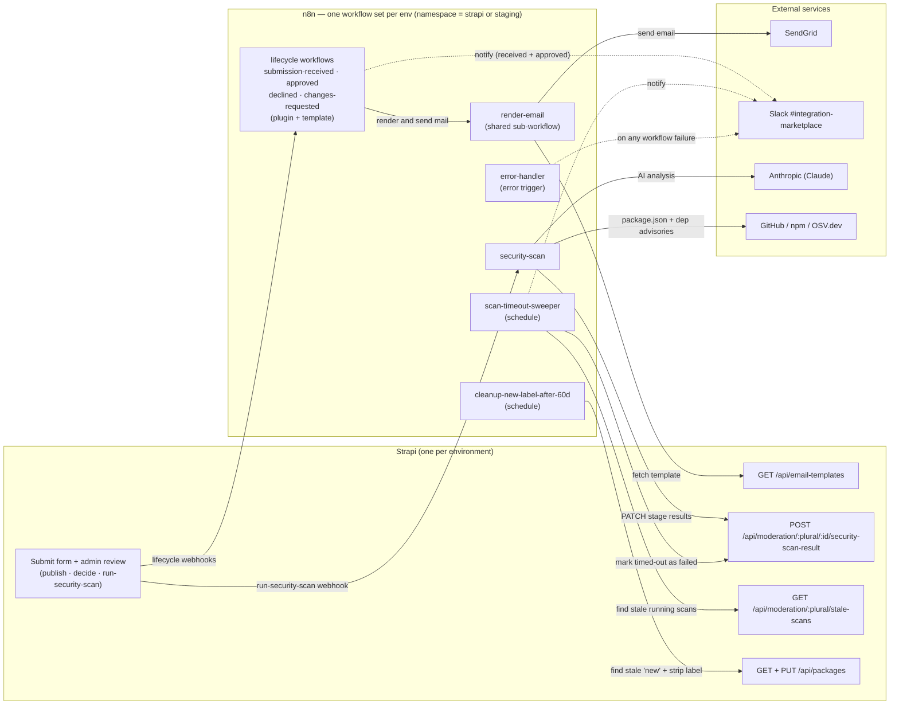

# Community Hub automation — n8n workflows

These workflows power moderation automation. Strapi emits lifecycle webhooks → n8n
orchestrates developer emails (SendGrid), Slack notifications, and the security scan,
and calls back into Strapi for templates and scan results.

> **Multi-environment on a shared n8n instance.** Staging and production run
> **duplicate workflow sets in the same n8n instance**, separated by a webhook
> **namespace** (`strapi` for production, `staging` for staging). Each set has its own
> credentials, its own Strapi base URL, and its own webhook paths
> (`/webhook/<namespace>/<event>`) so the two sets never collide. The n8n-internal
> workflow IDs also differ per set, so by-id references are re-linked on deploy.

## Architecture



The 7 lifecycle workflows have **no** Strapi URL of their own — they send mail through
the shared `render-email` sub-workflow, which is the only one that fetches templates.
Only **4 workflows** call Strapi directly (render-email, security-scan,
scan-timeout-sweeper, cleanup).

## Deploy to an environment (recommended)

`workflows:deploy` imports every workflow into a target instance with the
environment's Strapi base URL and webhook namespace applied, and re-links the by-id
references automatically. Imported **inactive**. Safe to re-run: it re-attaches existing
credential bindings by node name, so a re-deploy won't wipe the credentials you bound.

```bash
N8N_URL=https://n8n.tools.strapi.team \
N8N_API_KEY=<target instance key> \
STRAPI_BASE_URL=https://<this-env-cms> \
N8N_WEBHOOK_NAMESPACE=staging \            # omit/`strapi` for production
pnpm --filter automation run workflows:deploy
```

It (1) rewrites every HTTP node's base URL from the committed `http://localhost:1337`
placeholder to `STRAPI_BASE_URL`, (2) rewrites webhook paths to
`<namespace>/<event>`, and (3) re-points `executeWorkflow → render-email` and
`Settings → Error Workflow → error-handler` to the target instance's ids.

> **Plain `workflows:import`** is the no-substitution variant (local dev): matches by
> name, updates in place, but leaves the `localhost` base URL and `strapi/` paths and
> does **not** re-link — fine for `localhost:5678` against a local Strapi.

### After deploy (manual, once per set)
1. **Bind the 5 credentials** in the n8n UI (next section).
2. **Activate** the 8 webhook workflows + `render-email` (+ the two schedule workflows when wanted).

## n8n credentials (bound in the UI, per set)

There are **no n8n environment variables** — the Strapi token lives in a credential.

| Credential | Type | Value | Bound to (nodes) |
|---|---|---|---|
| **Strapi API** | HTTP Header Auth | `Authorization` = `Bearer <Strapi API token>` | the **9 Strapi HTTP nodes**: render-email *Fetch Template*; security-scan *PATCH Scan/AI/Summary*; scan-timeout-sweeper *Find Stale ×2 + Mark Failed*; cleanup *Fetch Stale + Strip Label* |
| **n8n Webhook Auth** | HTTP Header Auth | `X-N8N-Auth` = `<shared secret>` | the **8 webhook trigger nodes**. Must equal Strapi `N8N_WEBHOOK_AUTH_VALUE`. |
| **SendGrid** | SendGrid API | n8n SendGrid key (community@strapi.io account) | render-email *Send via SendGrid* |
| **Slack** | Slack API (bot token) | bot token for `#integration-marketplace` | the **6 Slack notify nodes** |
| **Anthropic** | Anthropic API (predefined) | Anthropic API key | security-scan *Claude Haiku Security Analysis* (node uses *Predefined Credential Type → Anthropic*) |

> The two Header Auth credentials use different header names (`Authorization` vs
> `X-N8N-Auth`) — create them separately.

## Base URL (handled by the deploy script)

The Strapi base URL appears in **9 HTTP nodes across 4 workflows**
(security-scan ×3, scan-timeout-sweeper ×3, cleanup ×2, render-email ×1); the other 8
workflows have none. `workflows:deploy` sets all 9 from `STRAPI_BASE_URL`, so you never
hand-edit them. It can't live in a credential (HTTP Request credentials are auth-only)
or an n8n Variable (instance-wide — can't differ between the two sets on one instance),
so it's a per-set node value that the deploy script fills.

## Strapi environment variables (per instance)

| Variable | Value |
|---|---|
| `N8N_WEBHOOK_BASE_URL` | this environment's n8n base URL |
| `N8N_WEBHOOK_MODE` | `production` (always-on `/webhook/...` paths; workflows must be **active**) |
| `N8N_WEBHOOK_NAMESPACE` | `strapi` (prod, default) or `staging` — must match the deployed set's webhook paths |
| `N8N_WEBHOOK_AUTH_HEADER` | `X-N8N-Auth` |
| `N8N_WEBHOOK_AUTH_VALUE` | the shared secret — must equal the **n8n Webhook Auth** credential value |
| `CLOUD_APP_URL` | Strapi admin URL (builds `dashboard_link` in Slack; auto-set on Strapi Cloud) |
| `SENDGRID_API_KEY` | Strapi-native email only (password resets / admin invites) — **separate** from n8n's SendGrid key |

Also generate a **Strapi API token** (admin → Settings → API Tokens; full-access for
first bring-up) → paste into the **Strapi API** n8n credential. It needs read on
`email-template` and access to the `moderation` content-API routes
(`/:plural/:documentId/security-scan-result`, `/:plural/stale-scans`).

## Notes / gotchas

- **Versions are pinned for portability:** HTTP Request nodes at `typeVersion 4.4`, n8n
  image at `n8nio/n8n:2.27.4`. If a node shows *"install this node / from a newer
  version of n8n,"* the target instance is older — bump it, or lower the `typeVersion`.
- **`approved` requires a publishable record:** publishing a package/template needs
  `slug` (and `description` for packages) set first, or publish 400s and the `approved`
  webhook never fires. Reviewers set these before approving.
- **Webhook namespace** comes from the CMS plugin config (`N8N_WEBHOOK_NAMESPACE`,
  default `strapi`) in `config/plugins.ts` + `config/env/production/plugins.ts`.
